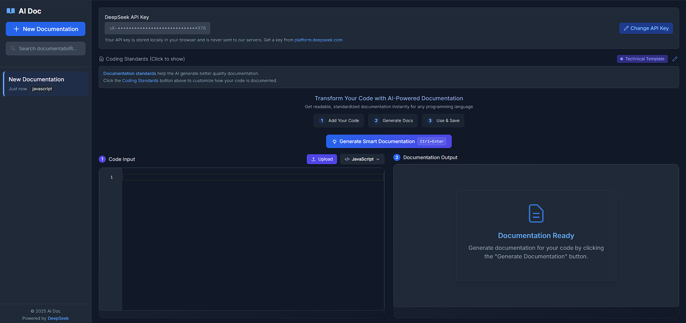

# AI Doc - AI-Powered Code Documentation Generator

AI Doc is a web-based tool that helps developers generate meaningful documentation for their code using artificial intelligence, with a clean, modern interface inspired by DeepSeek Chat.



## Features

- **Code Input**: Paste code directly into the editor or upload a file
- **Automatic Language Detection**: Automatically detects the programming language of your code
- **Multiple Documents**: Create and manage multiple documentation pages
- **AI-powered**: Uses DeepSeek's API to generate intelligent documentation
- **Standards Integration**: Applies coding standards to improve documentation and code
- **Modern UI**: Built with React, Next.js and Tailwind CSS
- **Monaco Editor**: Uses the same editor as VS Code for a familiar experience
- **Export**: Download documentation as markdown files

## Getting Started

### Prerequisites

- Node.js 18.x or newer
- A DeepSeek API key (obtain from [DeepSeek](https://deepseek.com))

### Installation

1. Clone this repository
2. Install dependencies:
   ```bash
   npm install
   ```
3. Start the development server:
   ```bash
   npm run dev
   ```
4. Open [http://localhost:3000](http://localhost:3000) in your browser

## Usage

1. Enter your DeepSeek API key in the settings bar at the top
2. Paste your code or upload a file using the Upload button
3. Click "Generate Documentation" to create documentation
4. Your documentation will appear in the Documentation Output panel
5. Create new documentation pages using the "New Documentation" button
6. Navigate between your saved documentation pages using the sidebar

## Project Structure

```
├── public/               # Static assets
├── src/
│   ├── app/              # Next.js app directory
│   │   ├── api/          # API routes
│   │   ├── layout.tsx    # Root layout
│   │   └── page.tsx      # Home page
│   ├── components/       # React components
│   ├── data/             # Static data (coding standards)
│   ├── styles/           # Global styles
│   └── utils/            # Utility functions
├── .gitignore            # Git ignore file
└── package.json          # Project dependencies
```

## Technologies Used

- **Next.js**: React framework for server-side rendering
- **React**: Frontend library
- **TypeScript**: Type-safe JavaScript
- **Tailwind CSS**: Utility-first CSS framework
- **Monaco Editor**: Code editor component
- **DeepSeek API**: AI code analysis and documentation generation

## Contributing

Contributions are welcome! Please feel free to submit a Pull Request.

## License

This project is licensed under the MIT License - see the LICENSE file for details.

Visit [http://localhost:3000](http://localhost:3000) in your browser to use the application.

## How to Use AI Doc

1. **Add Your Code**: Write or paste code in the editor on the left
2. **Add Your API Key**: Enter your DeepSeek API key in the settings panel
3. **Generate Documentation**: Click the "Generate Documentation" button or press Ctrl+Enter
4. **View Results**: The generated documentation appears in the right panel
5. **Save or Download**: Your documentation is automatically saved, and you can download it as needed

## Technologies

- **Frontend**: React, Next.js, Tailwind CSS
- **Editor**: Monaco Editor (same as VS Code)
- **AI**: DeepSeek API

## Limitations

- Requires a valid DeepSeek API key
- Large code files may take longer to process
- Documentation quality depends on the quality and complexity of the input code

## Project Structure

- `/src/app`: Main application pages and API routes
- `/src/components`: Reusable React components
- `/src/utils`: Utility functions for code processing
- `/public`: Static assets

## License

MIT
